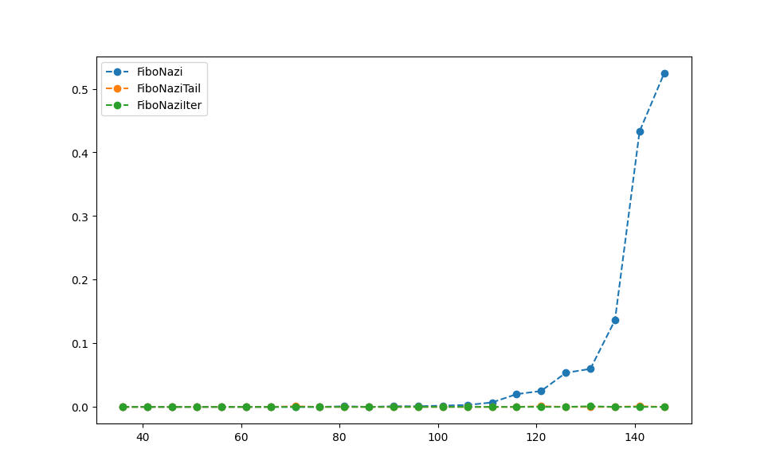

## FiboNazi

Se implementaron 3 versiones de la funcion y se llego a la conclusion que la version recursiva normal es notablemente mas lenta que las otras versiones pues, por cada llamada a la funcion, se generan 'alfa' llamadas recursivas, lo que trae como consecuencia que, para n muy altos, la funcion se vuelva completamente inviable.

En el grafico se puede observar que la version de recursion de cola y la version iterativa se mantienen constantes y la funcion recursiva normal comienza a crecer notablemente a partir de n=100.

Esto se debe a que la funcion recursiva normal requiere hacer alfa llamadas recursivas a la funcion para calcular cada paso que va dando. En su lugar, la funcion recursiva de cola accede a alfa elementos que estan ya en la cola (accion que es O(1)) y los suma, resultando asi en que la funcion recursiva de cola es de orden O(n) al igual que la version iterativa.